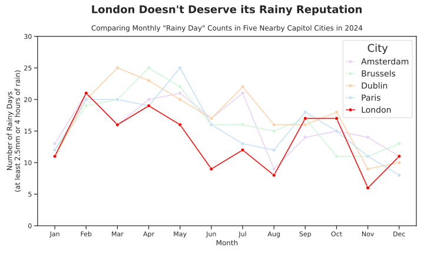

## README

Thea West

Due: 22 Jul, 2025, 8pm BST

### Goal:

This project attempts to answer the question: Is London really as rainy as the movies make it out to be?

### Methodology:

I used [OpenMeteo](https://open-meteo.com/en/docs/historical-weather-api)'s historical rain sum and precipitation hours parameters for the year 2024 in London, Amsterdam, Brussels, Dublin, and Paris. I chose to use one year of data to account for all 4 seasons throughout the year but not request so much data as to limit other students' access. 2024 is a very recent year and therefore gives better insight into how rainy London currently is in comparison to these other cities.

I defined a "rainy day" as having at least 2.5mm of rain, at least 4 hours of rain, or both. I have found official definitions of a "rainy day" ranging from 0.1mm to 3.0mm of rain. I chose 2.5 as it seems like enough water to put a damper on the day (0.1mm is nothing) but also a low enough threshold that I will not disclude too much data. I did not find any definitions of a "rainy day" which included number of hours it rained, but I personally feel that even if it was a very light rain (not meeting the 2.5mm mark), if it lasted for 4 hours or more it would still feel like a rainy day.

I chose to compare London to Amsterdam, Brussels, Dublin, and Paris as these other four capitol cities are all relatively near London (within a 350 mile radius). London is almost certainly more rainy than, for example, Cairo, Egypt, as they are in very different geographical locations with extremely different climates. I thought it would be more interesting to compare London to nearby cities which would have more similar climates to see if London really is in a specifically rainy location or if this section of the western coast of Europe is rainy all over and London just happened to be the one to get the rainy reputation.

### Result:

The data showed that London was actually the least rainy of the five cities in 2024. The result is in the plot:

